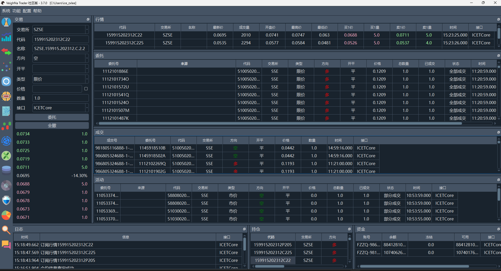
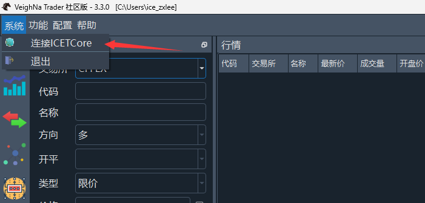
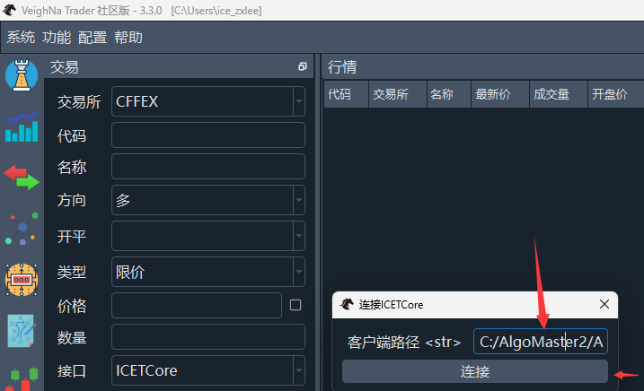
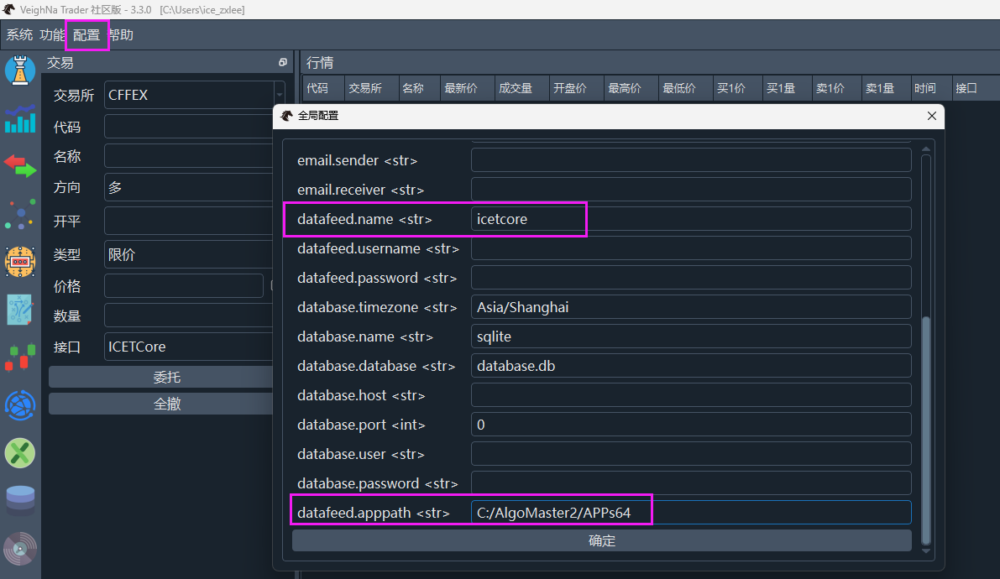

# vnpy_icetcore

#### 介绍
基于咏春大师2量化版接口的vnpy gateway

#### 安装教程

1.  该分支为vnpy特定分支
2.  该分支只支持内盘期货和期权
3.  在vnpy_icetcore目录中的sample目录，运行范例文件即可启动vnpy
4.  需要安装[咏春大师2量化客户端](https://www.algostars.com.cn/)，同时需要安装icetcore接口，
pip install icetcore -U，只能在windows环境下运行
4.  启动并登入咏春大师量化版之后，再启动vnpy，启动vnpy后

